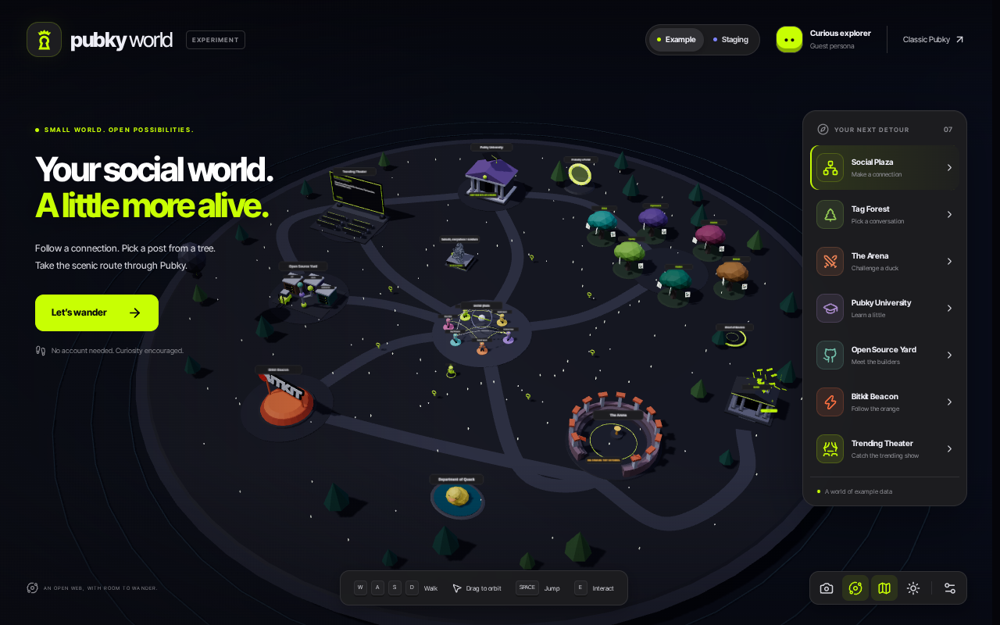

# Pubky World

A frontend experiment forked from `pubky/pubky-app` at the head of `dev`.
The exact fork point and destination are in [fork.json](./fork.json).
The project lives in the private `its-gaib/pubky-3d` repository. Its working
branch retains the upstream history and is also this workspace repository's default branch.

The root route is a walkable island. The existing Pubky feed remains at `/home`.
The world begins with original, explicitly fictional example posts and inhabitants.
Use the staging switch to populate it from the public staging Nexus. No sign-in is
needed to explore the world.

The world uses Pubky's near-black and graphite palette with acid-lime accents.
**Classic Pubky** opens the public [pubky.app](https://pubky.app/) in a new tab.
The expanded island gives districts separate grounds; walking paths are plain
graphite surfaces without colored borders. Shared layout anchors keep fast travel,
collisions and the pocket map aligned as the world grows.



## Places

- **Social Plaza:** people become little characters, connected by curved ribbons.
  Arrowheads and moving lights point from a follower to the person they follow.
  These are example relationships in demo mode and sampled following records in
  staging mode. Interacting with a staging person shows their profile picture,
  with the normal Pubky fallback if the picture is missing or unavailable.
  Characters are graph representations, not online visitors.
- **Tag Forest:** every tree represents a tag. Each paper leaf opens a post that
  carries that tag. A tag can also be opened as an accessible list.
- **The Arena:** a deliberately silly local rock, paper, scissors challenge.
- **Pubky University:** short lessons with links to the official Pubky documentation.
- **Open Source Yard:** linked workshops introducing the organization's projects.
- **Bitkit Beacon:** the official Bitkit logo extruded into a large 3D landmark.
- **Trending Theater:** an outdoor stage cycles through up to eight posts from
  Pubky's public Hot feed, in total-engagement order. Each post stays on screen
  for 20 seconds. Opening the program pauses it for reading; controls resume,
  pause or skip. No date-window ranking is implied. The example program is
  explicitly fictional; use Staging to load the current public lineup. The stage
  and its reader show a loading screen while the lineup is being fetched.
  Articles display readable text instead of their stored JSON;
  malformed content gets an unavailable notice and a link to the original post.
- **Satoshi monument:** an original seated, hooded laptop figure made of separated
  vertical steel contours. Walk around it to see the silhouette change. Its
  plaque is beside the plaza and also reachable from the Social Plaza reader.
- **Brrr Bank:** an east-side bank continually prints dollar confetti. Thirty
  reusable bills drift, shrink and fade independently, with a visual BRRR sign
  and no audio. Reduced motion keeps the scattered bills still. Its reader is
  also available from the Arena panel.
- **Detours:** giant duck, trampoline, portal, floating balloon, dancing, and eight
  collectible keys. Collected keys are local game props with no monetary value.
- **Camera:** frame a picture, keep a PNG postcard, or send it to Pubky's post
  composer with the photo attached and an editable caption.

## Local preview

Use the Node version in `.nvmrc`, then install dependencies with `npm ci`.
The dependency installation and local test commands do not need real account keys.

```sh
npm run dev:webpack -- --hostname 127.0.0.1 --port 4321
```

Open `http://127.0.0.1:4321/`. On a host connected to this workspace over SSH:

```sh
ssh -fN -o ExitOnForwardFailure=yes -L 127.0.0.1:4321:127.0.0.1:4321 gaib
```

`-fN` leaves a background tunnel running on the host.

Default development runtime configuration targets staging. The world's staging
loader requires both the staging environment label and the exact official staging
Nexus URL. It refuses a production or mismatched endpoint. The world never asks
for a recovery phrase; use test keys only if trying the inherited account flows.

## Controls

| Input                                   | Action                           |
| --------------------------------------- | -------------------------------- |
| W A S D / arrows                        | Walk relative to the camera      |
| Shift                                   | Run                              |
| Space                                   | Jump                             |
| E                                       | Interact with the nearby object  |
| F                                       | Dance                            |
| R                                       | Return to the plaza              |
| Drag the scene                          | Orbit the camera                 |
| Scroll                                  | Zoom                             |
| Click ground                            | Walk to that spot                |
| Click a landmark, person, tree, or leaf | Open it                          |
| Destination navigation                  | Travel directly to a district    |
| Camera button                           | Capture and review a world photo |

Touch controls, overview, nighttime lighting, reduced motion, and avatar colors
are available in the interface. Reading panels pause world movement. The world
also exposes its contents through buttons when WebGL is unavailable.

## Camera and posting

Orbit and zoom to frame the scene, then press the camera button beside the view
controls. The photo contains the rendered world, including your persona, with the
HUD excluded. Review it, download a PNG, or open the normal Pubky post composer.
The composer starts with the photo attached and an editable postcard caption.
Publishing uses its existing **Post** button, attachment validation, authenticated
write path and image sanitization. The destination is visibly labelled staging or
production according to the app's runtime configuration; development defaults to
staging.

The capture is bounded to a 2048-pixel longest edge. Photos and drafts stay in
memory, and preview object URLs are released when closed or replaced. Sign in
before taking a photo you want to publish. Guests can download first; navigating
away to sign in clears the in-memory photo. An opened draft is cleared on logout
or account changes.

The current local preview runs the full Next application against staging. Live
reads, photo capture/download and the guest sign-in flow have been checked in a
browser, and the developer has confirmed that staging login works. An actual post
submission has not been performed by the browser checks. The earlier lightweight
visual harness supported capture/download only.

## Implementation boundaries

- `src/components/templates/World`: HUD, reading dialogs, local arena game,
  keyboard-accessible alternatives and touch controls.
- `src/libs/world/world-scene.ts`: Three.js lifecycle, island, forest, relationships,
  player input and camera. Loaded only when the world mounts.
- `src/libs/world/world-landmarks.ts`: original procedural buildings and props.
- `src/libs/world/world-theater.ts`, `world-satoshi.ts` and `world-bank.ts`:
  the rotating public-post screen, steel monument, and bounded confetti animation.
- `src/libs/world/world-motion.ts`: camera-relative movement and simple collision
  resolution. The map uses a flat walkable plane; this is not a full physics engine.
- `src/libs/world/world-types.ts`: serializable world data and `PersonaState`.
- `src/libs/world/world-post-preview.ts`: bounded text previews shared by post
  leaves and the theater, with kind-aware article and collection parsing.
- `src/hooks/useWorldData`: opt-in, bounded public reads through existing Pubky
  controllers. The normal cache and moderation behavior remains in those layers.
- `src/components/templates/World/WorldCamera.tsx` and `src/hooks/useWorldPhotoPost`:
  local photo review and an explicit handoff to the existing post composer.

The data loader renders at most six tag trees, four verified posts per staging
tree, eight trending posts, six people and twelve confirmed follow edges. Counts describe the displayed
sample. Missing results are left empty, never replaced with fictional records in
staging mode. A 20-second deadline bounds the loading UI. Existing controllers do
not expose transport cancellation, so reads already issued may finish filling
their shared cache after cancellation; they cannot replace world state afterward.

The existing auth guard, database provider, account routes and write flows are
preserved. `/` is explicitly public, with the world's HUD replacing the normal
header and floating action button only on that exact route.

## Next multiplayer increment

`WorldController.getPersonaState()` returns position, heading and an animation
state without depending on a Pubky session. Keep that state contract when adding
a presence transport and separate remote avatars from graph-person characters.
The current world has no presence server, networking claims, or online-user count.

A future presence service needs its own design for session-bound identity, room
limits, update frequency, interpolation, disconnect handling and position
validation. Authentication must be handled by the existing account boundary;
clients must never broadcast account keys or recovery phrases.

## Validation

```sh
npm run typecheck
npm run lint -- src/libs/world src/components/templates/World src/hooks/useWorldData src/hooks/useWorldPhotoPost src/components/organisms/WorldAwareChrome
npm test -- src/libs/world/world-motion.test.ts src/libs/world/world-post-preview.test.ts src/libs/world/world-theater.test.ts src/hooks/useWorldData/useWorldData.test.ts src/components/templates/World/World.test.tsx src/app/routes.test.ts src/providers/RouteGuardProvider/RouteGuardProvider.test.tsx
npm test -- src/components/templates/World/WorldCamera.test.tsx src/hooks/useWorldPhotoPost/useWorldPhotoPost.test.tsx src/components/organisms/DialogNewPost/DialogNewPost.test.tsx src/components/organisms/PostInput/PostInput.test.tsx
npm run build
```

See [the validation record](./validation.md) for the successful full CI build,
browser evidence and the remaining automated publishing check. The manual Build
workflow packages a standalone runtime after staging HTTP smoke checks; its build
step uses a bounded 4 GiB Node heap. This avoids compiling the full app on the
memory-constrained preview host.

The world has no inherited visual baseline. Browser screenshots provide the first
visual review checkpoint; adding a dedicated VRT baseline is a possible next step
once the visual direction is accepted. Keep production builds and the running dev
server sequential because they share `.next`.

No public deployment or registry PR is part of this increment.

The source-focused security review found no actionable issue in the world changes.
The upstream dependency tree still has npm audit advisories, including Next.js and
its nested Sharp/PostCSS dependencies and build/test tooling. No matching high or
critical exploitable world path was identified. Update and validate those inherited
dependencies before public deployment; adding a 3D view does not resolve them.

## Sources and assets

The high-level inspiration is the explorable island at
[miguelmedeiros.dev](https://miguelmedeiros.dev/). No source code or visual assets
from that site are copied into this fork. The island and all of its toy buildings,
characters and vegetation are generated from original code.

University summaries link to [pubky.org](https://pubky.org/), and project exhibits
link to [the Pubky GitHub organization](https://github.com/pubky/).

The Satoshi sculpture is an original procedural homage to Valentina Picozzi's
[Lugano monument](https://tether.io/news/plan-b-initiative-unveils-satoshi-nakamoto-statue-at-3rd-annual-plan-forum-in-lugano/).
No photograph or third-party model of that artwork is bundled. Its separated
vertical contours echo the original's disappearing-angle concept.

`public/world/bitkit-logo.svg` comes from the
[official Bitkit logo](https://bitkit.to/images/brands/logo-header-bitkit.svg).
Its colors and usage derive from the [Bitkit brand manual](https://bitkit.to/brand-manual).
Bitkit branding remains the property of its owner; the repository's MIT license
does not grant separate trademark rights or relicense that asset. The logo is
bundled locally, parsed from a fixed path and extruded using Three.js's SVGLoader.
